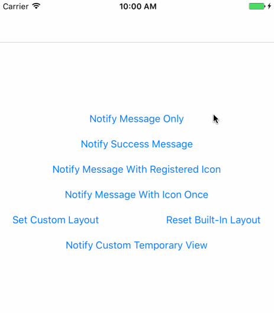

# ZTDropDownNotification

`ZTDropDownNotification` is a notification class that displays a drop-down notification
from top edge of key window and dismisses it after a duration. The default layouts can
display message only or message with icon. It also supports custom layout and displays
custom view directly. The notification is inspired by Mobile QQ, aiming to provide a
handy way to show notifications.

<p align="center">
  
</p>

## Requirements

`ZTDropDownNotification` works on iOS 8+ and requires ARC to build. It depends on the following Apple frameworks, which should already be included with most Xcode templates:

* Foundation.framework
* UIKit.framework

You will need the latest developer tools in order to build `ZTDropDownNotification`. Old Xcode versions might work, but compatibility will not be explicitly maintained.

## CocoaPods

1. Add `pod 'ZTDropDownNotification', '~> 1.0.0'` to your Podfile.
2. Install the pod(s) by running `pod install`.
3. Include ZTDropDownNotification wherever you need it with `#import "ZTDropDownNotification.h"`.

## Usage

### Notify Message Only

```objective-c
  [ZTDropDownNotification notifyMessage:@"content" withIcon:nil];
```

### Shortcut Notifying Messages

Shortcut notifying methods use `ZTNInfoIconKey`, `ZTNSuccessIconKey` and `ZTNFailureIconKey` to get corresponding icon.

For example, register `ZTNSuccessIconKey` icon as following:

```objective-c
  [ZTDropDownNotification registerIcons:@{
      ZTNSuccessIconKey: [UIImage imageNamed:@"check_green"]
      }];
```

And then `notifySuccessMessage:` method works as expected:

```objective-c
  [ZTDropDownNotification notifySuccessMessage:@"content"];
```

> **Note**:  
> It will "notify message only" if the corresponding icon isn't registered before.

### Notify Message with Custom Registered Icon

```objective-c
  [ZTDropDownNotification notifyMessage:@"content" withIconKey:@"ExampleIconKey"];
```

### Notify Message with Temporary Icon

```objective-c
  [ZTDropDownNotification notifyMessage:@"content" withIcon:[UIImage imageNamed:@"thumbs_up_blue"]];
```

### Set Custom Layout as Default Layout

```objective-c
  [ZTDropDownNotification setCustomLayoutGenerator:^UIView <ZTNLayout> * {
    return [CustomLayout new];
  }];
```

> **Note**:  
> Due to current implementation(1.0.0), custom layout and view should leave an extra **8pt** height area on top of the real content area.

### Reset to Built-in Layouts

```objective-c
  [ZTDropDownNotification setCustomLayoutGenerator:nil];
```

### Notify Custom Temporary View

```objective-c
  [ZTDropDownNotification notifyView:view];
```

> **Note**:  
> Due to current implementation(1.0.0), custom layout and view should leave an extra **8pt** height area on top of the real content area.

## TODO
- [ ] Add unit tests.
- [ ] Integrate Travis CI.
- [ ] Find a better solution to avoid the spring animation on the top edge when the view shows totally.
- [ ] Support Swift.

## License

Released under [MIT license](LICENSE).